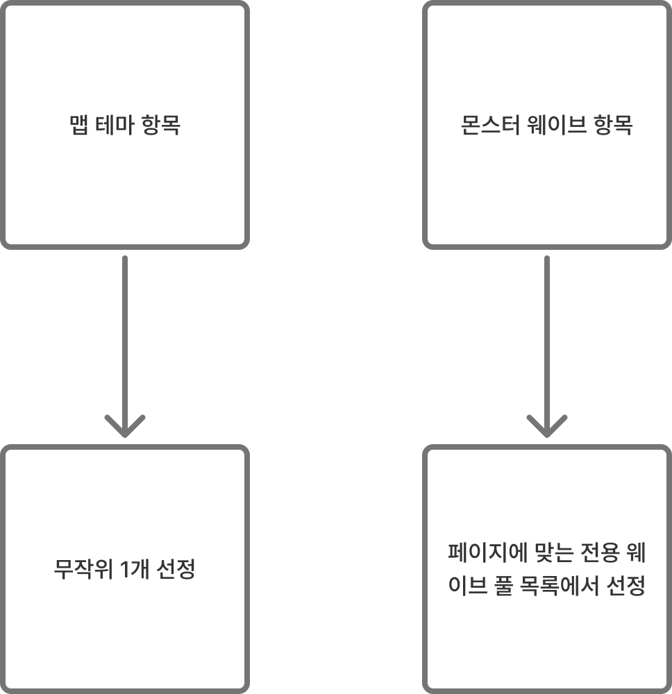

# 전투 구간 선정 시스템

**업데이트** : 2026.06.06
**작성자** : 김덕용
**버전** : 0.0.1 (문서 작성)

### 업데이트 내역

| **업데이트 날짜** | 2026.06.06 |
| --- | --- |
| **작성자** | 김덕용 |
| **버전** | 0.0.1 |
| **변경 내역** | 문서 작성 |

---

# 1. 시스템 개요

- 로그라이크 덱빌딩 플레이에서 일반 전투 구간 생성 시, 맵 테마와 몬스터 웨이브를 무작위 조합하여 산출된 '위험도'를 기반으로 합당한 보상을 자동 매칭하는 생성 시스템임.
- 전투 난이도에 정비례하는 보상을 제공하여 데이터 기반의 정량적인 밸런싱 기준을 확립하고 플레이어의 납득 가능한 도전 목표를 제공함.
- 플레이어가 직접 선택하여 진입한 전투 조합만을 스테이지 블랙리스트에 등록함으로써, 유의미한 무작위성을 보존하는 동시에 완벽히 동일한 전투 경험의 반복을 차단하는 것을 목적으로 함.

# 2. 핵심 개념 및 작동 원리

### 페이지 전환 및 풀 정제

스테이지의 진행도를 전반부(Phase 1)와 후반부(Phase 2)로 분리함.

중간 보스를 클리어하여 후반부로 전환되는 즉시, 몬스터 웨이브 추첨 목록이 '후반부 전용 웨이브 리스트'로 고정되며 이전 목록은 더 이상 등장하지 않음.

### 위험도 선결정 및 보상 후 배정

전투 구간 생성 시 [맵 테마의 기믹 페널티 점수]와 [웨이브의 스펙 난이도 점수]를 선별하여 합산함. 이 총합 점수를 ‘총 위험도 점수’로 규정하고, 해당 위험도 수치 대역에 맞춰 보상의 종류(일반 카드, 특정 라인 카드, 카드 강화)를 후배정함.

### 조합 및 보상 중복 방지

2지선다 선택지 내에서 도출된 일반 전투의 보상이 타 선택지와 동일하게 측정될 경우, 보상만 바꾸는 것이 아니라 [맵 테마 + 웨이브] 자체를 재추첨하여 난이도-보상의 일치 원칙을 유지하며 중복을 방지함.

### 경험 기반 스테이지 블랙리스트

무작위 추첨으로 선택지에 노출된 시점이 아닌, 플레이어가 2지선다 중 '해당 전투를 최종 선택하여 진입'한 시점에만 해당 [맵 테마 + 웨이브 + 보상] 조합을 블랙리스트에 등록함.

### 그리드 노드 직관화

내부 로직으로 확정된 모든 구간 정보(일반, 이벤트, 휴식, 상점)를 그리드 타일 상단에 [구간 타입] + 보상 : [보상 아이콘]의 포맷으로 시각화하여 플레이어가 진입 전 어떤 이득과 종류의 노드인지 즉각 파악하도록 함.

# 3. 상세 프로세스

## 단계 1 : 일반 전투 구성 요소 추첨

시스템 가중치 굴림을 통해 선택지 자리에 ‘일반 전투’가 당첨될 경우 작동.

현재 스테이지의 진행 페이지(전반부/후반부)를 확인

[맵 테마]는 전체 맵 테마 풀에서 1종을 무작위 추첨하고, [웨이브]는 현재 페이지 상태에 맞는 전용 웨이브 풀 목록 안에서만 1종을 무작위 추첨함.

## 단계 2 : 위험도 측정 및 보상 배정

단계 1에서 도출된 맵 테마의 위험도 점수와 웨이브의 위험도 점수를 합산하여 ‘총 위험도 점수’룰 산출함.

산출된 ‘총 위험도 점수’가 속한 밸런싱 테이블의 구간을 참조하여, 대응되는 보상 등급을 확정함.

총 위험도 점수 계산

총 위험도에 맞는 보상 조회 후 선정

## 단계 3 : 조합 검증

아래 두 조건 중 하나라도 걸릴 경우 단계 1로 돌아가 전체 조합을 재추첨 진행.

### 보상 중복 검사

확정된 보상이 2지선다 내에 이미 생성된 타 선택지의 보상과 일치하는지 검사

### 블랙리스트 검사

완성된 [맵 테마 + 웨이브 + 보상] 조합이 현재 스테이지의 블랙리스트에 존재하는지 대조함.

## 단계 4 : 블랙리스트 등록 - 플레이어가 해당 진입 시

검증을 통과해 화면에 노출된 2개의 선택지 중, 플레이어가 특정 일반 전투를 선택하여 스테이지에 진입.

진입 즉시 해당 전투의 [맵 테마 + 웨이브 + 보상] 고유 조합 데이터를 스테이지 블랙리스트에 기록함.

선택받지 못한 조합은 블랙리스트에 기록되지 않고 버려짐.

# 4. 세부 규칙

### 페이지 전환 규칙

스테이지 진입 시점부터 중간 보스 클리어 이전까지는 전반부(Phase 1) 리스트에서만 몬스터 웨이브를 추첨함.

중간 보스를 처치하고 넘어간 시점부터는 후반부(Phase 2) 전용 리스트에서만 [웨이브]를 추첨하며, 전반부 리스트에 있던 웨이브는 등장하지 않음.

### 위험도 산출 규칙

위험도는 오직 ‘맵 테마의 페널티 점수’와 ‘몬스터 웨이브 점수의 합산’으로만 결정
`[총 위험도 점수] = [맵 테마 패널티 점수] + [몬스터 웨이브 점수]`

### 재추첨 규칙 - 중복 조정

보상이 겹치거나 블랙리스트에 걸려 재추첨이 발생할 경우, 기존에 뽑혔던 테마나 웨이브 중 일부만 유지하는 것이 아니라 두 가지 변수를 모두 초기화하고 완전히 새롭게 추첨함.

### 진입 기준 블랙리스트 규칙

선택지에 노출되었으나 플레이어가 선택하지 않아 진입하지 않은 조합은 '경험하지 않은 조합'으로 간주함.

따라서 블랙리스트에 등록되지 않으며, 향후 추첨 풀에서 정상적으로 다시 등장할 수 있음.

# 5. 밸런싱 데이터 구조

### 총 위험도 구간별 보상 매칭표

- 위험도 합 5 이하 : 일반 카드 확정
- 위험도 합 6~10 : 특정 라인 카드 확정
- 위험도 합 11 이상 : 카드 강화 확정

# 6. 예외 처리 방안

### 재추첨 무한 루프 발생 시 방어

스테이지 후반부 진행으로 인해 블랙리스트가 과도하게 누적되거나, 현재 스테이지에 할당된 맵/웨이브 종류 풀이 적어서 재추첨 횟수가 시스템 허용치(예: 최대 5회)를 초과할 수 있음.

해당 횟수 초과 시, 중복 보상 회피 룰과 블랙리스트 대조 룰을 강제로 무시하고 가장 낮은 등급의 위험도(위험도 총합 5 이하)와 보상(일반 카드)을 가진 디폴트 조합을 임의로 강제 출력하여 게임 진행 불가(Soft-Lock) 상태를 방지함.